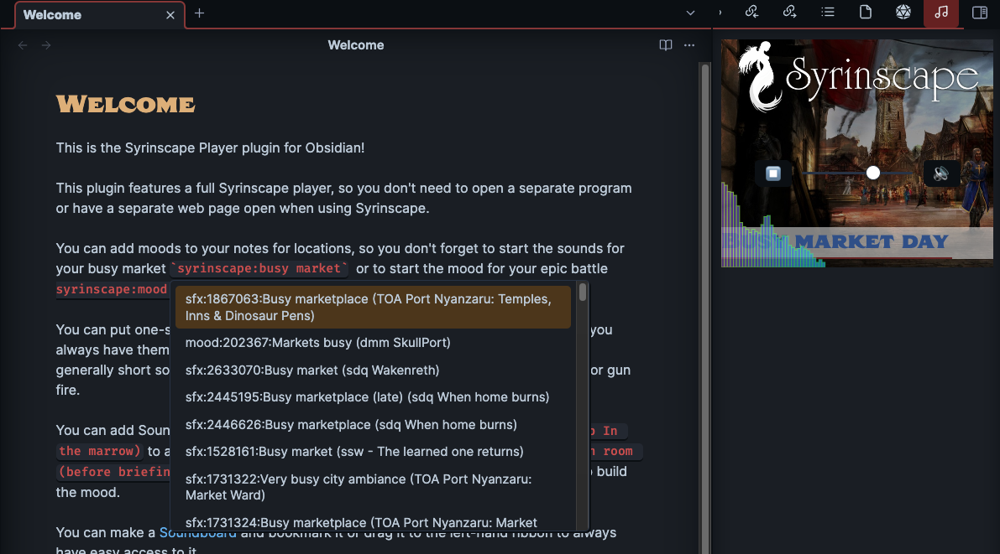
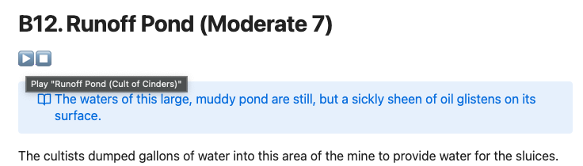
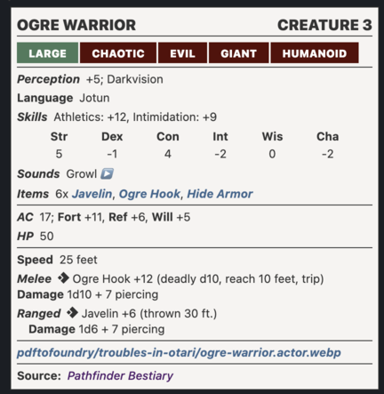
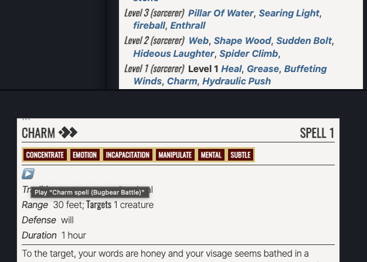

## Module Summary

This module is designed for people using Obsidian as their TTRPG management tool to integrate Syrinscape with Obsidian. Syrinscape is a powerful tool for creating and playing custom soundtracks, sound effects, and ambient sounds for tabletop role-playing games.

Embed controls to start and stop moods and elements on your pages that describe locations, spells or events.

## How to Use

1. Install the Syrinscape module for Obsidian using the Community Plugin Manager in Obsidian.

2. Once installed, open the settings and copy your Auth token from https://syrinscape.com/online/cp/. Paste that into the setting for Auth Token.

3. Use the following markdown syntax to embed a Syrinscape soundscape:

    ```
    `syrinscape:mood:soundId:optional mouseover text`
    ```

    ```
    `syrinscape:element:soundId:optional mouseover text`
    ```

4. The plugin has downloaded a list of all the sounds you have access to, and so the auto-complete feature will make entering the codes easy for you.
    
    
5. Save your note and switch to View Mode to have a play and stop button which will start/stop the selected sound.

## Screenshots

### Put a link to the mood for every scene at the top of the page for the scene, and never forget to start the Syrinscape mood for that room again!

Note that **Moods** get a play and a stop button.



### The plugin works very well inside of [Fantasy Statblocks](https://github.com/javalent/fantasy-statblocks)

Note that **Oneshots** only get a play button.



### And it also works when with [Initiative Tracker](https://github.com/javalent/initiative-tracker) so you have easy access for spell or melee oneshots during combat.

