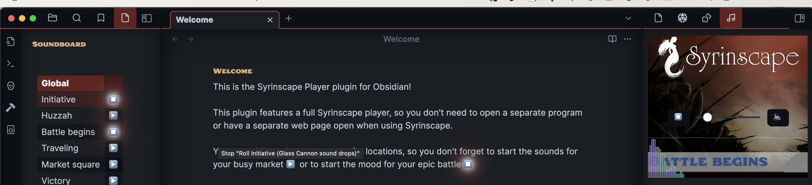
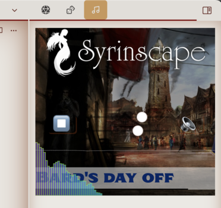
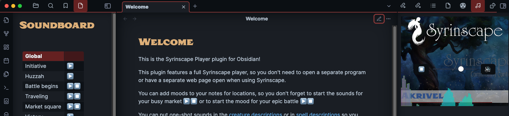
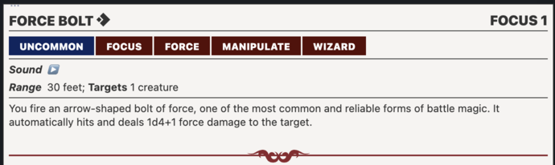
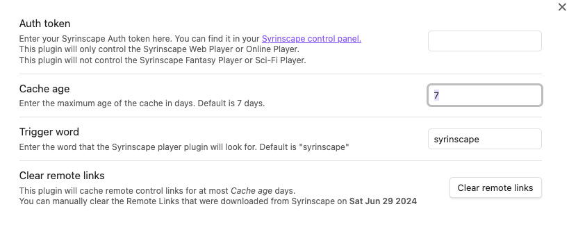

## **Enhance Your TTRPG Experience with the Syrinscape Player Plugin for Obsidian!**

Welcome, Game Masters! Are you looking to elevate your tabletop role-playing sessions with immersive soundscapes and dynamic audio effects? Look no further! The Syrinscape Player plugin for Obsidian is here to transform your game into an unforgettable auditory adventure. Say goodbye to playing disc jockey while GMing. Prep the perfect mood ahead of time and have instant access to it during your session, complete with a an easy play/stop button to remind you to activate it at just the right moment.

### See it in action


### **What this plugin offers**

**Seamless Integration:** Manage your TTRPG campaigns using Obsidian? Perfect! This plugin integrates Syrinscape Web Player directly into Obsidian, so no more switching between tabs or apps. Everything you need is right at your fingertips.

**Instant Atmosphere:** Whether it's the bustling ambiance of a market or the tension of an epic battle, set the mood effortlessly. Attach sounds to your notes for each location and scene, ensuring you never forget to activate the perfect soundscape.



**Dynamic Soundscapes:** Add layers of sound effects and music loops to your ongoing scenes. Build the atmosphere step by step, enhancing the immersion for your players.

**Custom Soundboard:** Create a personalized soundboard for quick access. Bookmark it or drag it to the left-hand ribbon for instant availability during your game sessions.


**Embedded Player Control:** Control the sound directly within Obsidian. See what's playing, adjust the volume, and quickly mute or stop all sounds with ease. Need more control? Launch the Syrinscape browser version with a single click.


### **Getting Started: How to Use**

1. **Install the Plugin:** Find the Syrinscape module in Obsidian's Community Plugin Manager and install it.
2. **Authenticate:** Retrieve your Auth token from [Syrinscape's website](https://syrinscape.com/online/cp/) and paste it into the plugin settings.
3. **Embed Sounds:** Use the following markdown syntax to embed different types of Syrinscape sounds. Replace `soundId` with the actual ID of the sound you want to embed, and optionally add mouseover text for additional context:
    - **Mood:** 
      ```markdown
      `syrinscape:mood:soundId:optional mouseover text`
      ```
    - **Music:** 
      ```markdown
      `syrinscape:music:soundId:optional mouseover text`
      ```
    - **Sound Effect (SFX):** 
      ```markdown
      `syrinscape:sfx:soundId:optional mouseover text`
      ```
    - **Oneshot:** 
      ```markdown
      `syrinscape:oneshot:soundId:optional mouseover text`
      ```
4. **Auto-Complete Convenience:** The plugin's auto-complete feature makes adding sounds a breeze, providing you with a list of all accessible sounds.
    

5. **Style Settings and dark theme support:** You can control the colors used for both light and dark themes by downloading the [Style Settings](obsidian://show-plugin?id=obsidian-style-settings) plugin.

### **Ideas of where to use this**

**Set the Scene:** Add mood links at the top of your scene notes to ensure you never miss setting the perfect ambiance.


**Add to Fantasy Statblocks:** Works seamlessly within [Fantasy Statblocks](obsidian://show-plugin?id=obsidian-5e-statblocks) for quick access to sound effects when fighting creatures.


**Spell descriptions:** Include sounds in the spell descriptions so that when your players cast a spell, you'll have easy access to trigger the sound.


### **Fine-Tune Your Settings**

The plugin updates your remote links weekly, ensuring you have the latest sounds. For those creating custom soundsets, refresh your links anytime from the settings menu.



### **Join the Adventure!**

Immerse your players in a world of sound. With the Syrinscape Player plugin for Obsidian, every session becomes a cinematic experience. Install now and take your TTRPG game to the next level!
