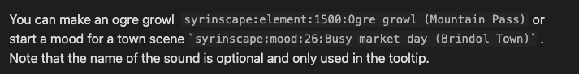
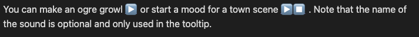

## Module Summary

This module is designed for people using Obsidian as their TTRPG management tool to integrate Syrinscape with Obsidian. Syrinscape is a powerful tool for creating and playing custom soundtracks, sound effects, and ambient sounds for tabletop role-playing games.

Embed controls to start and stop moods and elements on your pages that describe locations, spells or events.

## How to Use

1. Install the Syrinscape module for Obsidian using the Obsidian community plugin manager.

2. Once installed, open the settings and copy your Auth token from https://syrinscape.com/online/cp/. Paste that into the setting for Auth Token.

3. Use the following markdown syntax to embed a Syrinscape soundscape:

    ```
    `syrinscape:mood:soundId:optional mouseover text`
    ```

    ```
    `syrinscape:element:soundId:optional mouseover text`
    ```

    Replace "soundId" with the desired id number which is available in the Syrinscape Online Player which chosing "Show Remote Control Links" or "Download Remote Control Links (CSV)".

    Use either mood or element (also visible in the remote control links)

4. Save your note and switch to View Mode to have a play and stop button which will start/stop the selected sound.

## Screenshots
This is the plugin in-action:



And how it looks when in reading mode

