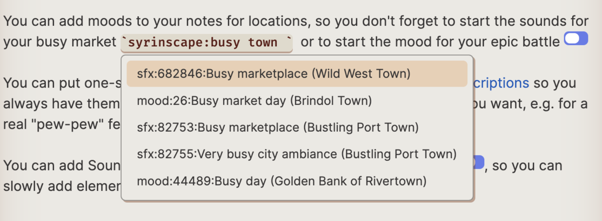

## Module Summary

This module is designed for people using Obsidian as their TTRPG management tool to integrate Syrinscape with Obsidian. Syrinscape is a powerful tool for creating and playing custom soundtracks, sound effects, and ambient sounds for tabletop role-playing games.

Embed controls to start and stop moods and elements on your pages that describe locations, spells or events.

Please note that this plugin requires that you have a [Syrinscape account](https://syrinscape.com/dashboard/) (but not a subscription) and be running either the [Syrinscape Online Player](https://syrinscape.com/download/) or the [Web Player](https://app.syrinscape.com) to actually hear sounds. Sounds are *not* played through Obsidian.

## How to Use

1. Install the Syrinscape module for Obsidian using the Community Plugin Manager in Obsidian.

2. Once installed, open the settings and copy your Auth token from https://syrinscape.com/online/cp/. Paste that into the setting for Auth Token.

3. Use the following markdown syntax to embed a Syrinscape soundscape - both the play and stop button will be displayed:

    ```
    `syrinscape:mood:soundId:optional mouseover text`
    ```

    ```
    `syrinscape:music:soundId:optional mouseover text`
    ```
    ```
    `syrinscape:sfx:soundId:optional mouseover text`
    ```
4. Use the following markdown syntax to embed a Syrinscape oneshot - only the play button will be displayed, since oneshots will automatically stop.

    ```
    `syrinscape:oneshot:soundId:optional mouseover text`
    ```

    :attention: Note that to preserve compatability, you can also use "element" to not display the stop button, but oneshot is the preferred syntax.

4. The plugin has downloaded a list of all the sounds you have access to, and so the auto-complete feature will make entering the codes easy for you.
    
    
5. Save your note and switch to View Mode to have a play and stop button which will start/stop the selected sound.

## Screenshots

### Put a link to the mood for every scene at the top of the page for the scene, and never forget to start the Syrinscape mood for that room again!

Note that **Moods** get a play and a stop button.


--- 

### The plugin works very well inside of [Fantasy Statblocks](https://github.com/javalent/fantasy-statblocks)

Note that **Oneshots** only get a play button.


---

### And it also works when with [Initiative Tracker](https://github.com/javalent/initiative-tracker) so you have easy access for spell or melee oneshots during combat.

Edit the spell descriptions to include a link to the corresponding one-shot and now anytime a creature has access to that spell, you have easy access to the sound effect during battle!


--- 

## Soundboard

With Obsidian and Syrinscape, you now have complete control over your soundboard. Make a note, e.g. `Soundboard.md` that contains any syrinscape sounds you want. Use any formatting and grouping you want. Once you have that in place, you can drag the note up to the Ribbon - the same location as e.g. the default `Files`, `Search`, and `Bookmarks`. Once there, you have one-click access to your soundboard.


## Settings

This plugin will only download your remote links once a day. If you are e.g. creating your own soundsets and want the plugin to get a fresh set of links, you can open the settings and press the button labeled "Clear Remote Links".


